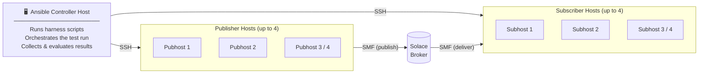
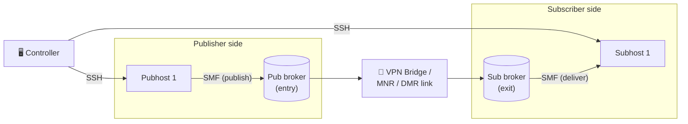

# Solace Performance Test Harness

An automated test harness for measuring and validating the message throughput of Solace brokers — software brokers and hardware appliances alike. Uses Ansible to orchestrate [sdkperf_c](https://docs.solace.com/API/SDKPerf/SDKPerf.htm) across multiple remote Linux test hosts.

### What is it good for?

- **Validate a broker tier before go-live** — run a pre-built benchmarking testset and get a pass/fail result against Solace-published throughput targets for your tier and message type
- **Characterise new or unknown hardware** — automatically discover the maximum stable message rate a broker can sustain across a range of message sizes, fanout values, and message types, without needing to guess target rates upfront
- **Reproduce Solace reference performance numbers** — independent, repeatable measurement using the same tooling and methodology as Solace's own published figures
- **Characterise inter-broker link throughput** — measure the message throughput ceiling of a VPN bridge, MNR, or DMR link by publishing to one broker and subscribing on the other; the harness manages both sides automatically

---

## Quickstart

### 1. Set up

Run the guided setup wizard to configure your test hosts and broker credentials:

```bash
./setup.sh
```

This writes `config/host` (Ansible inventory) and `config/credentials.yaml`, explains SSH key requirements, and checks that dependencies (`ansible`, `dnsutils`) are installed.

Then place the `sdkperf_c` binary in `pubSubTools/` — download it from the [Solace developer portal](https://solace.com/downloads/).

---

### 2. Choose your mode

#### Validate — run a fixed-target benchmarking test

Use this when you know what tier your broker is and want to confirm it meets spec. Pre-built testsets cover software broker tiers (1k/10k/100k), high-performance on-prem servers, Solace Cloud (TLS), and the 3560 hardware appliance.

```bash
./start-benchmarking-test.sh          # interactive menu
# or invoke directly:
benchmarking-tests/ent-10k-gm-ha.sh <broker-ip>
```

Each scenario reports **PASS** or **FAIL** against the published target rate (within a 5% margin).

---

#### Characterise — discover the maximum throughput of an unknown broker

Use this when you don't have target rates — new hardware, a new configuration, or initial characterisation of any broker. The harness probes automatically using exponential search followed by binary search, converging to within ±1% of the true ceiling.

```bash
./start-standard-discovery-test.sh    # standard scenario matrix (100B/1KB/20KB × f1/f5/f50)
```

---

#### Custom — build a bespoke discovery testset

Use this to design your own scenario matrix: choose message types, sizes, fanout values, host counts, and upper bounds. The wizard generates a reusable script you can re-run at any time.

```bash
./start-custom-discovery-test.sh
# saved to custom-sets/<name>.sh — re-run directly:
./custom-sets/<name>.sh [broker-ip]
```

---

#### Mesh — characterise a VPN bridge, MNR, or DMR link

Use this when you want to measure the throughput of an inter-broker link rather than a single broker. Publishers connect to one broker; subscribers connect to the second. Messages traverse the configured link, so the measured rate is the link's throughput ceiling.

```bash
./mesh-tests/mesh-discovery.sh <pub-broker-ip> <sub-broker-ip>
```

Broker IPs can also be set in `config/credentials.yaml` (`pub_broker` / `sub_broker`) and omitted from the command line. `./setup.sh` will offer to configure mesh credentials during setup.

---

## How it works



The harness is structured in four layers:

```
User entry points  →  Engine runners  →  Ansible playbook  →  Remote host scripts
```

1. **User entry points** (`start-*.sh`, `benchmarking-tests/*.sh`, `discovery-tests/*.sh`, `custom-sets/*.sh`) define test scenarios as arrays and delegate to an engine runner.

2. **Engine runners** loop over scenarios and call the Ansible playbook for each one:
   - `engine/run-testset.sh` — fixed-target mode; each scenario has a known target rate; pass/fail within 5% margin
   - `engine/run-binsearch-testset.sh` — discovery mode; exponential probe then binary search; stops at ±1% precision
   - `engine/run-binsearch-testset-mesh.sh` — mesh discovery mode; identical search logic but routes publishers and subscribers to separate brokers via `pub_broker`/`sub_broker`

3. **Ansible playbook** (`engine/start-sdk.yaml`) copies `sdkperf_c` and the publisher/consumer scripts to test hosts over SSH, starts consumers first (async), then publishers at the target rate, polls both to completion, and collects stdout.

4. **Remote scripts** (`scripts/sdkpublisher.sh`, `scripts/sdkconsumers.sh`) run on test hosts. Each spawns N sdkperf_c processes pinned to CPU cores via `taskset`, collects rate statistics, and prints a summary line the runner parses.

For a visual walkthrough see `docs/Perf Test Harness-Overview-2026.pptx`.

---

## What you will need

- A Solace software broker or hardware appliance to test
- Publisher and consumer test hosts (Linux) — minimum 2, ideally 4 or more with 10 GbE connectivity
- A controller host (Linux) with Ansible installed and SSH access to all test hosts
- SSH keys from the controller installed on all test hosts
- A client username on the broker VPN with publish, subscribe, and guaranteed endpoint create permissions
- `sdkperf_c` binary placed in `pubSubTools/` on the controller (copied to test hosts by Ansible at run time)

> For minimal testing a single publisher host and a single consumer host is sufficient, but will limit achievable rates — especially for direct messaging at small message sizes where multiple publisher hosts are needed to saturate the broker.

---

## Running a fixed-target testset (known broker)

The `benchmarking-tests/` folder contains pre-configured testsets for common broker tiers and configurations. Each script defines target rates the broker is expected to achieve and reports pass/fail for each scenario.

The easiest way to run one is via the interactive menu:

```bash
./start-benchmarking-test.sh
```

Or invoke a testset script directly:

```bash
benchmarking-tests/ent-10k-gm-ha.sh <broker-ip>
```

### Self-managed software broker — enterprise tiers

Calibrated against a modern cloud VM (AMD EPYC, no TLS). Targets are tier-appropriate rates for SolOS 10.8.x+.

| Script prefix | Licensing tier | Typical infra |
|---|---|---|
| `standard-*` | Standard | 2 vCPU, 1 pub host |
| `ent-1k-*` | Enterprise 1k | 4 vCPU, 1 pub host |
| `ent-10k-*` | Enterprise 10k | 8 vCPU, 4 pub hosts |
| `ent-100k-*` | Enterprise 100k | 16 vCPU, 4 pub hosts |

Each tier has variants for message type and HA configuration:
- `-direct` — direct messaging
- `-gm-noha` — guaranteed (persistent) messaging, standalone broker
- `-gm-ha` — guaranteed messaging, HA pair (primary + backup + monitoring node)
- `-quick` — abbreviated run covering key scenarios only

### Self-managed software broker — high-performance on-prem

Targets for a dedicated on-prem server (AMD EPYC or Intel Xeon, NVMe SSD, 25 GbE+ NIC, no TLS). Rates are approximately 25% higher than the `ent-*` cloud equivalents.

| Script prefix | Licensing tier |
|---|---|
| `hiperf-1k-*` | Enterprise 1k |
| `hiperf-10k-*` | Enterprise 10k |
| `hiperf-100k-*` | Enterprise 100k |

Variants: `-direct`, `-gm-noha`, `-gm-ha` (no `-quick` variant).

### Solace Cloud baseline (TLS)

Minimum rates that should pass on both AWS and GCP Solace Cloud deployments, measured with TLSv1.2 AES256-GCM-SHA384, HA + encrypted mate-link.

| Script prefix | Tier |
|---|---|
| `cloud-2025-TLS-1k-*` | 1k |
| `cloud-2025-TLS-10k-*` | 10k |
| `cloud-2025-TLS-100k-*` | 100k |

Variants: `-direct`, `-gm` (single GM variant covers both HA configurations; targets are the minimum of AWS and GCP measurements).

### Hardware appliance

| Script | Description |
|---|---|
| `3560-ADB4-GM650k-direct.sh` | Solace 3560 appliance — direct messaging |
| `3560-ADB4-GM650k-gm-ha.sh` | Solace 3560 appliance — guaranteed messaging (HA pair) |
| `3560-ADB4-GM650k-quick.sh` | Solace 3560 appliance — abbreviated run |

Target rates are based on Solace-published measurements for the 3560 with NAB4+ADB4 cards and a GM650 licence key (e.g. ~6.8M msg/s direct at 1KB f=1, ~619k msg/s persistent HA at 1KB f=1). The GM key only affects persistent capacity — direct rates are the same for GM450 and GM650.

---

## Discovering the maximum throughput of an unknown broker

Use the discovery tests when you don't know what rates to expect — for example, new hardware, a new configuration, or initial characterisation of a broker.

Rather than specifying target rates, the script automatically finds the highest message rate the broker can sustain end-to-end for each scenario using two phases:

1. **Exponential probe** — doubles the rate from a low starting point until the first failure, quickly narrowing the search window without wasting iterations in the wrong part of the range.
2. **Binary search** — converges on the maximum stable rate within the window found by the probe.

The search stops early once precision reaches ±1% of the current midpoint (with an absolute floor of ±500 msgs/sec for very low-rate scenarios).

Test entries omit the target rate field:
```
msg_size:fanout:publisher_hosts:msg_type
```

**Standard discovery** — standard scenario matrix (100B, 1KB, 20KB × fanout 1/5/50), prompts for broker, SSH user, host count, and message types:
```bash
./start-standard-discovery-test.sh
```

**Custom discovery** — interactive wizard to choose message types, sizes, fanout values and upper bounds, generates a reusable testset under `custom-sets/`:
```bash
./start-custom-discovery-test.sh
```

The generated script is saved to `custom-sets/<name>.sh` and can be re-run directly at any time:
```bash
./custom-sets/<name>.sh [broker-ip]
```

### Upper bounds

The exponential probe starts at `upper_bound / 1024` and doubles upward. The defaults are conservative (software broker limits). Testsets for more capable brokers should override these via `export` before calling `engine/run-binsearch-testset.sh`:

| Variable | Default | 3560 w/ ADB4 |
|---|---|---|
| `search_upper_bound_direct` | 5,000,000 | 25,000,000 |
| `search_upper_bound_nonpersistent` | 2,000,000 | 20,000,000 |
| `search_upper_bound_persistent` | 1,000,000 | 5,000,000 |

See `discovery-tests/londonlab-discovery.sh` for an example of how to override these.

---

## Characterising inter-broker link throughput (mesh mode)

Mesh mode measures the throughput ceiling of a VPN bridge, MNR, or DMR link. Publishers connect to one broker (the entry side); subscribers connect to the other (the exit side). Messages traverse the link, so the measured rate reflects what the link itself can sustain — not the individual broker limits.



### Setup

1. Configure mesh credentials in `config/credentials.yaml` — either by running `./setup.sh` (which offers an optional mesh setup section at the end) or by adding the fields manually using `config/credentials.yaml.example` as a template.

2. Ensure the inter-broker link (VPN bridge, MNR, or DMR) is already configured and active between the two brokers before running the test.

3. Run the standard mesh discovery testset:

```bash
./mesh-tests/mesh-discovery.sh <pub-broker-ip> <sub-broker-ip>
```

Broker IPs can be omitted if `pub_broker` and `sub_broker` are set in `config/credentials.yaml`.

The script tests 20480B messages at fanout=1 (direct and persistent) — the optimal size for characterising link bandwidth on 1 GbE and 10 GbE links. Smaller messages hit broker CPU or IOPS limits before the link, so they measure the broker rather than the link. Estimated runtime ~20 min.

### Mesh credentials

The following fields must be present in `config/credentials.yaml` for mesh mode:

| Field | Description |
|---|---|
| `pub_broker` | Publisher-side broker hostname/IP (can be overridden by CLI `$1`) |
| `pub_broker_vpn` | VPN on the publisher-side broker |
| `pub_broker_username` | Client username on the publisher-side broker |
| `pub_broker_password` | Client password on the publisher-side broker |
| `pub_broker_tls` | Connect via TLS on port 55443 (`true`/`false`) |
| `pub_broker_port` | Override pub broker SMF port (optional; inherits `broker_port` if set) |
| `sub_broker` | Subscriber-side broker hostname/IP (can be overridden by CLI `$2`) |
| `sub_broker_vpn` | VPN on the subscriber-side broker |
| `sub_broker_username` | Client username on the subscriber-side broker |
| `sub_broker_password` | Client password on the subscriber-side broker |
| `sub_broker_tls` | Connect via TLS on port 55443 (`true`/`false`) |
| `sub_broker_port` | Override sub broker SMF port (optional; inherits `broker_port` if set) |

### Upper bounds

The exponential probe starts at `upper_bound / 1024`. Override via `export` before calling `engine/run-binsearch-testset-mesh.sh`:

| Variable | Default | `mesh-discovery.sh` |
|---|---|---|
| `mesh_upper_bound_direct` | 5,000,000 | 5,000,000 |
| `mesh_upper_bound_nonpersistent` | 2,000,000 | 2,000,000 |
| `mesh_upper_bound_persistent` | 1,000,000 | **5,000,000** |

`mesh-discovery.sh` raises the persistent bound to 5M to match direct, giving both scenarios the same probe start rate (~4,900 msg/s) and saving ~2 probe iterations on each persistent run.

### Results

The final summary table includes a **Bandwidth (Gbps)** column computed from `max_stable_rate × msg_size × 8 / 1,000,000,000`. For a 10 GbE inter-broker link with 20480B messages, expect results in the range of 8–9 Gbps (accounting for protocol overhead and flow control).

---

## Analysing results

`engine/analyse-result-set.sh` is run automatically after each testset completes. It parses the result file and prints a diagnostic summary identifying common bottlenecks and configuration issues.

You can also run it manually at any time:

```bash
# By test-set shorthand name (resolves to results/<name>_result.txt)
engine/analyse-result-set.sh 1k_mixed

# By full file path
engine/analyse-result-set.sh results/1k_mixed_result.txt

# On a directory
engine/analyse-result-set.sh results/my-run/

# Scan the whole results/ directory (no arguments)
engine/analyse-result-set.sh
```

The script checks for:

| Finding | What it means |
|---|---|
| `"Error in clock"` errors | Publisher host CPU saturated — sdkperf cannot sustain the requested rate |
| Publish rate flat across all scenarios | Publisher host or NIC is the bottleneck regardless of target |
| Low publish rate consistent across message sizes | WAN or throttled network link between publisher and broker |
| Publisher rate consistently ~50%/33%/25% of expected | Fewer publisher hosts contributed than specified — one or more `[pubhost]` entries were unreachable during the Ansible run |
| NIC approaching 1 GbE / 10 GbE | Publisher or consumer NIC bandwidth limit |
| Low persistent publish rate (target >> achieved) | Storage IOPS limit on the broker |
| Consumer rate < publish_rate × fanout | Messages dropped or not delivered to all subscribers |
| All persistent fail, direct OK | VPN message spool quota, guaranteed messaging not enabled, or missing endpoint-create permission |
| Publisher near target but all tests fail | Broker CPU, memory, or NIC is the bottleneck |

---

## Infrastructure sizing guidance

| Message size | Bottleneck | Notes |
|---|---|---|
| ≤ 1KB | Broker CPU / disk IOPS | Throughput largely independent of message size |
| 1KB–20KB | Disk write bandwidth (persistent) or broker CPU (direct) | Persistent rates fall as message size increases |
| ≥ 20KB | Network bandwidth (n * 10 GbE ≈ n * 1.25 GB/s per host / network interface) | Rate ≈ n * 1.25 GB/s ÷ msg_size per host, fanout has minimal effect on publisher rate |

For high-fanout scenarios (f ≥ 10), the consumer-side network becomes the binding constraint: each consumer host must handle `publish_rate × fanout` messages. With 1 consumer host on 10 GbE this limits useful fanout testing. Use multiple consumer hosts for accurate high-fanout results.

---

## Configuration

### config/credentials.yaml

Written by `./setup.sh` and gitignored. Required fields:

| Field | Description |
|---|---|
| `broker_vpn` | Broker VPN name |
| `broker_username` | Client username sdkperf connects as |
| `broker_password` | Client password |
| `sshuser` | SSH user on test hosts |
| `ssh_port` | SSH port on test hosts (default: `22`) |
| `pub_cores` | CPU cores on publisher hosts (sets parallel publisher processes) |
| `sub_cores` | CPU cores on subscriber hosts |
| `broker_tls` | Connect via TLS (`true`/`false`; default `false`) |
| `broker_port` | Override broker SMF port (optional; default: `55555` plaintext / `55443` TLS) |

The runner scripts (`run-binsearch-testset.sh`, `run-testset.sh`) validate that the three broker credential fields are present before starting any tests and abort with a clear message if any are missing. Copy `config/credentials.yaml.example` as a starting point if you are not using `setup.sh`.

For mesh mode, `config/credentials.yaml.example` also documents the `pub_broker_*` / `sub_broker_*` fields — see [Mesh credentials](#mesh-credentials) above.

### run-binsearch-testset.sh parameters

Key parameters in `engine/run-binsearch-testset.sh`:

| Parameter | Default | Description |
|---|---|---|
| `runlength` | 60 | Seconds per test run |
| `search_iterations` | 10 | Maximum binary search iterations |
| `allowed_error_margin` | 5 | Consumer rate must be ≥ (100 − margin)% of target to pass |
| `precision_pct` | 1 | Stop binary search when range ≤ ±1% of midpoint |
| `precision_threshold` | 500 | Absolute minimum precision floor (msgs/sec) |
| `inter_iteration_cooldown` | 5 | Seconds between iterations (allows broker queues to drain) |

### start-sdk.yaml parameters

Key parameters in `engine/start-sdk.yaml`:

| Parameter | Default | Description |
|---|---|---|
| `sshuser` | `perfharness` | SSH user on test hosts |
| `ansible_port` | `ssh_port` from credentials (default `22`) | SSH port used to connect to all test hosts |
| `sdk_publishers` | 4 | sdkperf_c publisher processes per host (match to core count) |
| `runlength` | 120 | Default run length (overridden by calling script) |

---

## Repository structure

```
setup.sh                         # Interactive setup wizard — configures hosts and explains requirements
start-benchmarking-test.sh       # Interactive menu to select and run a benchmarking test
start-standard-discovery-test.sh  # Wrapper to run a generic discovery test (prompts for all parameters)
start-custom-discovery-test.sh   # Builds a custom discovery testset and saves it to custom-sets/
VERSION                          # Harness version and release date (sourced by runner scripts)
bump-version.sh                  # Updates VERSION to a new semver and today's date
CLAUDE.md                        # Guidance for Claude Code (architecture, commands, formats)
CLAUDE.private.md                # Private Claude context — engagement results and notes (gitignored, not committed)

engine/                          # Core test engine
engine/run-testset.sh                  # Runs a fixed-target testset (pass/fail against known rates)
engine/run-binsearch-testset.sh        # Discovers max throughput via exponential probe + binary search
engine/run-binsearch-testset-mesh.sh   # Mesh variant: pub and sub connect to separate brokers
engine/run-test.sh               # Single-test wrapper around the Ansible playbook
engine/start-sdk.yaml            # Ansible playbook: deploys sdkperf_c, runs publishers and consumers
engine/analyse-result-set.sh     # Parses result files and prints diagnostic guidance

benchmarking-tests/              # Fixed-target testsets for known broker tiers
discovery-tests/                 # Discovery testsets (binary search format)
mesh-tests/                      # Mesh throughput testsets (pub and sub on separate brokers)
custom-sets/                     # User-generated custom discovery testsets (gitignored)
scripts/                         # sdkpublisher.sh and sdkconsumers.sh — run on test hosts
pubSubTools/                     # sdkperf_c binary and licences (not included in repo)
config/host                      # Ansible inventory (publisher and consumer hosts)
config/credentials.yaml          # Broker credentials for sdkperf (gitignored — not committed)
config/credentials.yaml.example  # Credentials template
docs/                            # Architecture overview, additional documentation, and LLM tool definitions
results/                         # Test result output files
temp/                            # Temporary per-iteration logs (cleaned up after each run)
```

---

## Versioning

The harness version and release date are stored in `VERSION` at the repo root and sourced by the runner scripts. The version is written into the "Test environment" header of every result file, making it easy to reproduce or compare runs.

To bump the version before committing a significant change:

```bash
./bump-version.sh v2.2.0
```

This updates `VERSION` to the new semver and sets the date to today. The `VERSION` file should be committed together with the change it describes.

---

## Additional documentation

- `docs/Perf Test Harness-Overview-2026.pptx` — architecture and methodology overview (Solace 2025 template)
- `docs/tools.json` — Anthropic-format tool definitions for the harness operations; pass the `tools` array to the Claude API to give an LLM the ability to run tests and analyse results programmatically
- `CLAUDE.md` — guidance for Claude Code: architecture overview, common commands, and test format reference

## Authors

Christian Holtfurth

## Resources

- [Solace Developer Portal](https://solace.dev)
- [sdkperf documentation](https://docs.solace.com/API/SDKPerf/SDKPerf.htm)
- [Solace community](https://solace.community)
